<div align="center">
  <picture>
    <source media="(prefers-color-scheme: dark)" srcset="assets/header.svg">
    
  </picture>
</div>

# Portable Agent Memory

**Project-local agent memory skill** — markdown is the source of truth; a hidden SQLite + FTS5 ledger (`.memsys-db`) is the regenerable index and search plane.

[](LICENSE)
[](https://www.python.org/)
[](skills/memory-system/references/memory_tool/constants.py)
[](https://agentskills.io/specification)
[](skills/memory-system/SKILL.md)

<sub>// crafted for the agent community — funding keeps it maintained</sub>

[](https://github.com/sponsors/VrilLabs)
[](https://opencollective.com/vrillabs)
[](https://ko-fi.com/vrillabs)
[](https://buymeacoffee.com/vrillabs)
[](https://thanks.dev/u/gh/vril-labs)

---

## Overview

This repository ships **`memory-system`**, a portable [Agent Skills](https://agentskills.io/specification)–compatible skill that gives coding agents a durable, project-local memory store.

The store lives **in the repo the agent is working on**, not in a hidden global sandbox:

```text
<project_root>/
  .memsys-db                 # hidden SQLite + FTS5 ledger (journal_mode=DELETE)
  memories/
    .memory-root             # schema marker
    .gitignore               # ignores user/ and ../.memsys-db by default
    user/                    # personal (default scope; typically not committed)
      MEMORY.md              # always-loaded index (≤200 lines)
      <topic>.md
      skills/
    team/                    # shared (only when the human asks)
      MEMORY.md
      <topic>.md
      skills/
```

Design contract (from the skill itself):

| Layer | Role |
| --- | --- |
| Markdown under `memories/` | **Source of truth** — human-readable prose |
| `.memsys-db` | Regenerable **index, ledger, and search plane** — never outranks files |
| `skills/memory-system/scripts/memory` → `references/memory_tool` | Deterministic Zone B CLI — JSON on stdout is truth |

It does **not** claim exclusivity over host memory mechanisms. If the agent runtime already has memory, treat this as an additional file-based layer beside it.

---

## Features

### Core capabilities

- **Portable project store** — discover root from `--cwd` via `memories/.memory-root` or project markers (`.git`, `package.json`, `pyproject.toml`, …)
- **Dual write** — every `write` / `edit` updates markdown first, then upserts the FTS5 ledger
- **Lexical search** — `search QUERY` tokenizes into quoted FTS5 tokens (`OR`-joined); raw `MATCH` never reaches SQLite
- **Fail-closed secrets** — pattern scan before write; hits log **rule name only**, never the secret text
- **Irreversible forget** — `forget PATH --confirm PATH` requires exact path match or exits without touching anything
- **Reindex from files** — if the ledger drifts or is deleted, `reindex` rebuilds it from markdown
- **Single hidden DB file** — `journal_mode=DELETE` only; no `-wal` / `-shm` sidecars (`validate` / `selftest` enforce this)
- **Stdlib only** — Python 3.9+, no third-party packages; optional `sqlite-vec` can attach later for hybrid recall

### Commands (`skills/memory-system/scripts/memory`)

| Command | Purpose |
| --- | --- |
| `init` | Create `memories/{user,team}/` + indexes + marker **and** `.memsys-db` from `schema.sql` |
| `root` | Print resolved project / memory roots |
| `glob [pattern]` | Enumerate store files — **the** reliable listing method |
| `read PATH` | Read + `sha256` (success chatter is not proof — this is) |
| `write PATH` | Create file after secret scan; `--overwrite` required to replace |
| `edit PATH --old X --new Y` | Exact-string replace; fails on 0 or >1 matches |
| `search QUERY` | Tokenized FTS5 over the ledger |
| `reindex` | Rebuild `.memsys-db` from on-disk markdown |
| `forget PATH --confirm PATH` | Delete file + drop ledger rows (paths must match) |
| `validate` / `status` | Binary store contract check / inventory |
| `classify` / `slug` / `scan-secrets` / `index-link` | Deterministic helpers |
| `selftest` | Sandbox assertion suite |

Exit codes: `0` ok · `1` fail · `2` usage · `3` secret · `4` not found · `5` ambiguous edit.

JSON envelope schema: **`memory-system/v1.1`**.

---

## Prerequisites

- **Python** ≥ 3.9 (stdlib only — `sqlite3` with FTS5)
- An agent runtime that loads [Agent Skills](https://agentskills.io/specification) (Claude Code, GitHub Copilot, Windsurf Cascade, Goose, Amp, Gemini CLI, Cursor, VS Code, or any host that reads `.agents/skills/`)

No API keys. No network. No daemons.

---

## Install

Copy the skill bundle into a skills path for your runtime:

| Runtime | Project path | User path |
| --- | --- | --- |
| Claude Code | `.claude/skills/memory-system/` | `~/.claude/skills/memory-system/` |
| GitHub Copilot | `.github/skills/memory-system/` | `~/.copilot/skills/memory-system/` |
| Windsurf Cascade | `.windsurf/skills/memory-system/` | `~/.codeium/windsurf/skills/memory-system/` |
| Cross-agent / Cursor / VS Code / Goose / Amp / Gemini CLI | `.agents/skills/memory-system/` | implementation default |

From this repo:

```bash
# example: install into the current project for cross-agent discovery
mkdir -p .agents/skills
cp -R skills/memory-system .agents/skills/memory-system
```

The skill layout:

```text
memory-system/
  SKILL.md                      # progressive disclosure entry (when to load)
  scripts/memory                # thin wrapper → memory_tool
  references/
    protocol.md                 # ingest → retrieve → reason → reflect → execute → package
    layout.md                   # store layout + root discovery
    when-to-save.md             # classify: skill / index / topic / reject
    constitution.md             # 16 never-rules
    memsys-db.md                # ledger contract
    examples.md                 # happy path, secret reject, overwrite recovery
    memory_tool/                # deterministic Zone B package
      schema.sql
      cli.py · core.py · ledger.py · selftest.py · …
  assets/templates/
  assets/schemas/
  examples/
```

---

## Quick start

Set the path to the memory tool once. From this repo root use `skills/memory-system/scripts/memory`; after installing the skill use your installed path (e.g. `.agents/skills/memory-system/scripts/memory`).

```bash
MEMORY=skills/memory-system/scripts/memory   # change if installed elsewhere

# from a real project root (or pass --cwd / --root)
$MEMORY --cwd . init

$MEMORY --cwd . write user/edge-tls.md \
  --content "# Edge TLS

Terminate TLS at Envoy.
"

$MEMORY --cwd . search "Envoy TLS"

$MEMORY selftest
# → "ok": true, exit 0
```

The agent loads the skill when you say *remember*, *forget*, *persist a preference*, *recall a decision*, or mention `memories/` / `MEMORY.md` / `.memsys-db`. Host-specific invokes (`/memory-system`, `@memory-system`) also work where supported.

### Typical agent workflow

```bash
MEMORY=skills/memory-system/scripts/memory   # change if installed elsewhere

$MEMORY --cwd . root
$MEMORY --cwd . glob "user/**/*.md"
$MEMORY --cwd . read user/MEMORY.md
$MEMORY --cwd . search "edge proxy"

$MEMORY classify --text "$PAYLOAD" --hint "$INTENT" --title "$TITLE"
$MEMORY slug "$TITLE"

$MEMORY --cwd . write user/<slug>.md --content-file "$TMP"
$MEMORY --cwd . index-link --scope user --slug <slug> --filename <slug>.md --summary "$ONE_LINE"
$MEMORY --cwd . read user/<slug>.md   # re-read is proof

# irreversible delete — confirm path must equal path
$MEMORY --cwd . forget user/<slug>.md --confirm user/<slug>.md

# ledger drift? rebuild from markdown
$MEMORY --cwd . reindex
```

---

## `.memsys-db` ledger

Markdown stays authoritative. The DB is a cache you can delete and rebuild.

| Table | Role |
| --- | --- |
| `files` | Per-file checksum ledger (`path`, `scope`, `sha256`, `lines`, `kind`) |
| `entries` | One row per markdown file |
| `entries_fts` | FTS5 over `slug + body` (content-synced by triggers) |
| `events` | Append-only audit (`write`, `reindex`, `secret_reject`, `forget`, …) |
| `secrets_hits` | Fail-closed scan results — **rule name + path only** |
| `vec_entries` | Placeholder for optional `sqlite-vec` KNN |

Hard rules:

- **Never WAL** — sidecars break the single-hidden-file contract
- **Never** pass raw FTS `MATCH` syntax to SQLite — tokenize and quote
- **Never** store secret text in the DB
- **Never** hand-edit the DB to change memory content — edit markdown, then `write` / `edit` / `reindex`
- Optional `sqlite-vec` attaches later; lexical search works alone offline

Full contract: [`skills/memory-system/references/memsys-db.md`](skills/memory-system/references/memsys-db.md).

---

## Security model

From the skill constitution (imperative — violation is a failed run):

1. Never expose or store secrets, credentials, or PII
2. Never proceed with irreversible ops without same-turn human confirmation naming the exact target
3. Never enumerate memory with `bash ls` / `find` / `tree` — use `glob` / `read`
4. Never treat compressed tool summaries as on-disk proof — re-`read` and compare `sha256`
5. Never default scope to `team`; never silently promote user → team
6. Never write outside `<project_root>/memories/`; never follow path traversal
7. Never skip `classify` + secret scan before a write
8. Never invent a recalled memory that `glob` / `read` / `search` did not return
9. Never enable WAL on `.memsys-db`; never let the ledger outrank markdown
10. Never add Adminer / GUI / daemon databases to the agent path

Classifier destinations:

| class | meaning | destination |
| --- | --- | --- |
| `skill` | workflow / playbook / checklist | `skills/<slug>/SKILL.md` |
| `index` | short preference | `MEMORY.md` bullet only |
| `topic` | durable note with a body | `<slug>.md` + index link |
| `reject` | secret pattern | nowhere |

---

## Repository map

```text
portable-agent-memory/
  README.md                 # this file
  LICENSE                   # MIT
  AGENTS.md                 # development guidance for the skill stack
  CLAUDE.md
  .github/FUNDING.yml       # GitHub Sponsors + community funding links
  assets/
    header.svg              # animated README header
    donate/                 # funding badges
  skills/
    memory-system/          # the installable skill bundle
```

Development guidance and the SQLite stack rationale live in [`AGENTS.md`](AGENTS.md). Skill-local docs start at [`skills/memory-system/SKILL.md`](skills/memory-system/SKILL.md) and [`skills/memory-system/README.md`](skills/memory-system/README.md).

---

## Verify

```bash
MEMORY=skills/memory-system/scripts/memory   # change if installed elsewhere
$MEMORY selftest
```

Must print `"ok": true` and exit `0`. The suite asserts journal mode, single-file DB (no `-wal`/`-shm`), FTS search, dual-write checksums, secret rejection, and forget purge semantics.

---

## Compatibility

| Surface | Support |
| --- | --- |
| Python | 3.9+ stdlib |
| Agent Skills open standard | Yes |
| Claude Code / Copilot / Windsurf / Goose / Amp / Gemini CLI / Cursor / VS Code | Skill path install |
| Network / cloud memory | Not required |
| Optional vectors | `sqlite-vec` later (same file); FTS5 alone is enough |

---

## Contributing

1. Keep Zone B (`references/memory_tool`) deterministic — do not reformat or second-guess its JSON
2. Markdown remains the only source of truth for prose
3. Run `MEMORY=skills/memory-system/scripts/memory; $MEMORY selftest` before proposing changes that touch the tool or ledger
4. Do not ship user rows, pre-filled DB binaries, WAL mode, or GUI/admin sidecars

---

## License

[MIT](LICENSE) — Copyright (c) 2026 Development Division.

---

## Support the project

If this skill saves you context-window thrash, consider funding maintenance:

- [GitHub Sponsors](https://github.com/sponsors/VrilLabs)
- [Open Collective](https://opencollective.com/vrillabs)
- [Ko-fi](https://ko-fi.com/vrillabs)
- [Buy Me a Coffee](https://buymeacoffee.com/vrillabs)
- [thanks.dev](https://thanks.dev/u/gh/vril-labs)

Funding config: [`.github/FUNDING.yml`](.github/FUNDING.yml).
